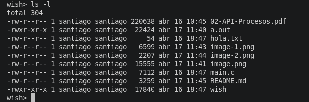
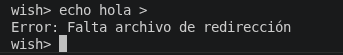
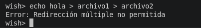
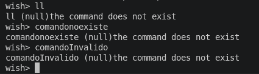
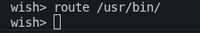

# Laboratorio de Sistemas Operativos donde debemos de hacer un shell simple en C

## Integrantes del equipo:
- Ricardo Medina Herrera 
    - C.C: 1036251162
    - Email: ricardo.medinah@udea.edu.co
- Santiago Villegas Naranjo
    - C.C: 1001479227
    - Email: santiago.villegasn@udea.edu.co

## [Video sustentación]()

## Documentación de las funciones
### Programa `wish`

#### Función `main`
La función principal es el punto de entrada del shell y se encarga de controlar cómo se reciben los comandos del usuario.

Primero se define un buffer `comando` de tamaño 100 para almacenar cada línea que el usuario ingresa.

Luego se determina el modo de ejecución del programa:

- Si `argc == 1`, el shell funciona en modo interactivo, es decir, lee directamente desde la entrada estándar (`stdin`) y muestra el prompt `wish> ` en cada iteración.
- Si `argc == 2`, se interpreta que se pasó un archivo como argumento, por lo que el programa entra en modo batch. En este caso, intenta abrir el archivo con `fopen` y leer los comandos desde ahí. Si no logra abrirlo, imprime un error y termina la ejecución.
- Si se pasan más de dos argumentos, se considera un uso incorrecto y se muestra el mensaje:
Usage: wish [batch_file]

y el programa finaliza.

Después de esto, se entra en un bucle infinito (`while (TRUE)`) donde:

1. Si está en modo interactivo, imprime el prompt `wish> `.
2. Lee una línea usando `fgets`.
3. Si `fgets` retorna `NULL` (por ejemplo, al terminar el archivo en modo batch), el programa cierra el archivo si es necesario y termina.
4. Si la lectura fue exitosa, se envía el comando a la función `manage_input` para que lo procese y ejecute.

---

#### Función `manage_input`
Esta función se encarga de procesar la línea completa ingresada por el usuario y ejecutar uno o varios comandos.

Primero verifica si el usuario escribió el comando `exit`. Si es así, el programa termina inmediatamente con `exit(EXIT_SUCCESS)`.

Luego elimina el salto de línea (`\n`) que deja `fgets` al final del string, usando `strcspn`.

Después, la función divide la línea en sub-comandos usando el operador `&`, que permite ejecutar comandos en paralelo. Esto se hace con `strsep`, guardando cada sub-comando en un arreglo `sub_cmds`.

Una vez separados los comandos, se recorren uno por uno:

- Para cada sub-comando se llama a la función `execute_single`.
- Si esta función retorna un PID mayor a 0, significa que se creó un proceso hijo, por lo que se guarda ese PID en el arreglo `pids`.

Es importante tener en cuenta que algunos comandos internos (como `chd` o `route`) no crean procesos hijos, por lo que `execute_single` retorna `-1` en esos casos y simplemente se ejecutan en el proceso padre.

Finalmente, la función espera a que todos los procesos hijos terminen usando `waitpid`, recorriendo el arreglo de PIDs almacenados previamente. Esto asegura que el shell no continúe hasta que todos los comandos en paralelo hayan finalizado.

## Problemas presentados durante el desarrollo

## Pruebas realizadas
### Prueba 1: Ejecución básica de comandos
`ls`

`pwd`

`echo hola`

### Prueba 2: Comandos con argumentos
`ls -l`

`echo hola mundo`

### Prueba 3: Ejecución en paralelo (`&`)
`ls & pwd`

`echo hola & echo mundo`

### Prueba 4: Redirección de salida
`echo hola > salida.txt`

`cat salida.txt`

### Prueba 5: Error en redirección
`echo hola >`

`echo hola > archivo1 > archivo2`

### Prueba 6: Comando inexistente

`ll`

### Prueba 7: Comando `chd`

`chd ..`

`pwd`

### Prueba 8: Comando `route`
`route /usr/bin/`

`ls`

### Prueba 9: Salida del shell
`exit`

## Transparencia