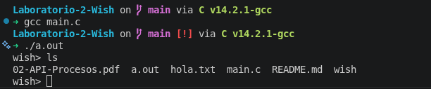
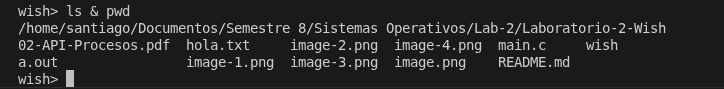
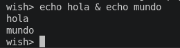
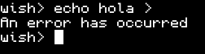
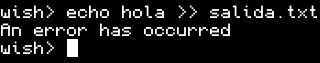
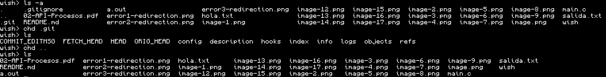
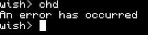
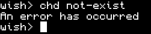
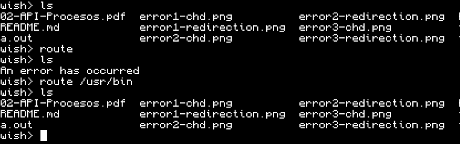
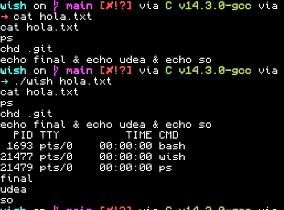

# Laboratorio de Sistemas Operativos donde debemos de hacer un shell simple en C

## Integrantes del equipo:
- Ricardo Medina Herrera 
    - C.C: 1036251162
    - Email: ricardo.medinah@udea.edu.co
- Santiago Villegas Naranjo
    - C.C: 1001479227
    - Email: santiago.villegasn@udea.edu.co

## [Video sustentación](https://youtu.be/LgLytJPA0DI?feature=shared)

## Documentación de las funciones
### Programa `wish`

#### Función `main`
La función `main` es el punto de entrada del shell y controla cómo se reciben y procesan los comandos.

Se define un buffer `comando` de tamaño fijo (100 caracteres) para almacenar cada línea de entrada. Luego se determina el modo de ejecución según los argumentos:

- Si `argc == 1`, el shell funciona en modo interactivo. Lee desde `stdin` y muestra el prompt `wish> ` antes de cada comando.
- Si `argc == 2`, se activa el modo batch. Se intenta abrir el archivo especificado con `fopen`. Si falla, se imprime un error y el programa termina.
- Si `argc > 2`, se considera un uso inválido y se termina la ejecución mostrando un error.

El programa entra en un bucle infinito donde:

1. Muestra el prompt si está en modo interactivo.
2. Lee una línea con `fgets`.
3. Si ocurre EOF (por ejemplo, fin de archivo o `Ctrl+D`), el programa termina correctamente. En modo batch, también cierra el archivo.
4. Si la lectura es válida, envía la línea a `manage_input` para su procesamiento.

---

#### Función `manage_input`
Esta función procesa la línea completa ingresada por el usuario y permite la ejecución de múltiples comandos en paralelo.

Primero elimina el salto de línea final (`\n`) usando `strcspn`, dejando la cadena lista para ser procesada.

Luego divide la entrada en subcomandos utilizando el operador `&`. Cada subcomando se almacena en el arreglo `sub_cmds`. Esto permite que el shell ejecute múltiples comandos en paralelo dentro de una misma línea.

Después, se recorren los subcomandos:

- Cada uno se pasa a la función `execute_single`.
- Si la función retorna un PID mayor a 0, significa que se creó un proceso hijo, por lo que ese PID se almacena.

Los comandos built-in no generan procesos hijos y retornan `-1`, por lo que se ejecutan directamente en el proceso padre.

Finalmente, la función espera a que todos los procesos hijos terminen utilizando `waitpid`, asegurando que el shell no continúe hasta que finalicen todos los comandos en paralelo.

---

#### Función `execute_single`
Esta función se encarga de procesar y ejecutar un único subcomando sin operadores `&`.

Primero normaliza la cadena de entrada insertando espacios alrededor del operador `>` para facilitar su separación en tokens en el caso de que el subcomando contenga el operaor `>`. Luego divide el comando en argumentos usando `strsep`, ignorando tokens vacíos generados por múltiples espacios.

Durante el parseo, detecta el operador de redirección `>` y valida que:

- Solo exista una redirección.
- No se utilice `>>` (lo cual es considerado error).
- Exista exactamente un archivo de salida después del operador de redirección.

Si alguna de estas condiciones falla, se imprime un error y la función retorna `-1`.

Si no hay tokens válidos, la función simplemente retorna `-1`.

La función implementa varios comandos built-in:

- `exit`: termina el shell. No acepta argumentos adicionales; en caso contrario, se considera error.
- `chd`: cambia el directorio actual usando `chdir`. Requiere exactamente un argumento.
- `route`: modifica la lista global `paths`.  
  - Si no recibe argumentos, limpia la lista de paths.  
  - Si recibe argumentos, los copia en `paths` usando `strdup`.
- `wish --version` o `wish -v`: imprime la versión del shell (`v0.0.1`), este comando built-in fue agregado como idea de los participantes para hacer referencia a los flags `-v`y `--version` que suelen tener los programas.

Si el comando no es built-in, se procede a buscar el ejecutable en las rutas almacenadas en `paths`. Para cada ruta, se construye el path completo y se verifica con `access` si el archivo existe y es ejecutable. Si no se encuentra, se imprime un error.

Cuando se encuentra el ejecutable, se realiza un `fork`:

- En el proceso hijo:
  - Si hay redirección, se abre el archivo de salida con `open` y se redirigen `stdout` y `stderr` usando `dup2`.
  - Luego se ejecuta el programa con `execv`.
  - Si `execv` falla, se imprime un error y el proceso termina.

- En el proceso padre:
  - Se retorna el PID del hijo para que pueda ser esperado posteriormente.

Si ocurre algún error o se ejecuta un built-in, la función retorna `-1`.

---

#### Función `error`
Esta función imprime un mensaje de error estándar `An error has occurred` acorde a la descripcción de la guía.

## Problemas presentados durante el desarrollo

- Al inicio del desarrollo del laboratorio, fue necesario dedicar un tiempo para comprender que ibamos a realizar. No se debía a una mala redacción, sino a que entender y tener una base del programa implicó leerlos varias veces y recordar los conceptos. Esto permitió establecer una base sólida para la solución y continuar con el desarrollo.

- Otro problema encontrado fue la modificación de los *paths* con el programa Route. Nuestra primera implementación presentaba un bug causado por el uso de un puntero, lo que provocaba que el cambio del *path* desapareciera después de ejecutar algunos comandos. La solución fue utilizar la función `strdup`.

- Al momento de crear nuevos procesos para ejecutar los programas ingresados por el usuario, utilizamos la función `fork`, pero inicialmente no empleamos `wait` debido a que no habíamos comprendido completamente porque era útil. Una vez entendido, pudimos resolver el problema.

- El desarrollo se enfocó en completar las funcionalidades descritas en la guía de forma secuencial. Debido a esto, al llegar a la parte de permitir la ejecución de múltiples programas separados por `&`, la lógica estaba diseñada únicamente para ejecutar un solo programa. La solución consistió en dividir esta lógica en dos funciones y agregar un procesamiento de la entrada utilizando `&` como separador.

## Pruebas realizadas
### Prueba 1: Ejecución básica de comandos
`ls`

`pwd`

`echo hola`

### Prueba 2: Comandos con argumentos
`ls -l`

`echo hola mundo`

### Prueba 3: Ejecución en paralelo (`&`)
`ls & pwd`

`echo hola & echo mundo`

### Prueba 4: Redirección de salida
`echo hola > salida.txt`

`cat salida.txt`

### Prueba 5: Error en redirección
`echo hola >`

`echo hola >> salida.txt`

`echo hola > archivo1 > archivo2`

### Prueba 6: Comando inexistente

`ll`

### Prueba 7: Comando `chd`

`chd .git`
`chd ..`

### Prueba 8: Error en `chd`

`chd`

`chd .git ..`

`chd not-exist`

### Prueba 9: Comando `route`
`route`

`route /usr/bin`

### Prueba 10: Comando `exit`
`exit`

### Prueba 11: Error en `exit`
`exit hola`

### Prueba 12: batch mode
`./wish hola.txt`

## Transparencia

- Se utilizó IA como apoyo para generar parte de la documentación dentro del código.

- Se utilizó IA para comprender el uso de funciones como `fork`, `wait`, `strsep`, `strcmp` y `waitpid`, ya que la información disponible en las *man pages* no fue suficiente para entender completamente su funcionamiento y los parámetros que reciben.

- También se utilizó IA para entender cómo extraer la salida de los programas y redirigirla a un archivo específico. A partir de estas consultas, identificamos el uso de funciones como `open` y `dup2`, y posteriormente profundizamos en su funcionamiento.

- En la sección de problemas mencionamos un error relacionado con el programa Route. Para encontrar la causa, además de realizar *debugging* con `printf`, utilizamos IA para identificar el origen del problema. Esto nos permitió comprender mejor la causa y por qué el uso de `strdup` lo soluciona.